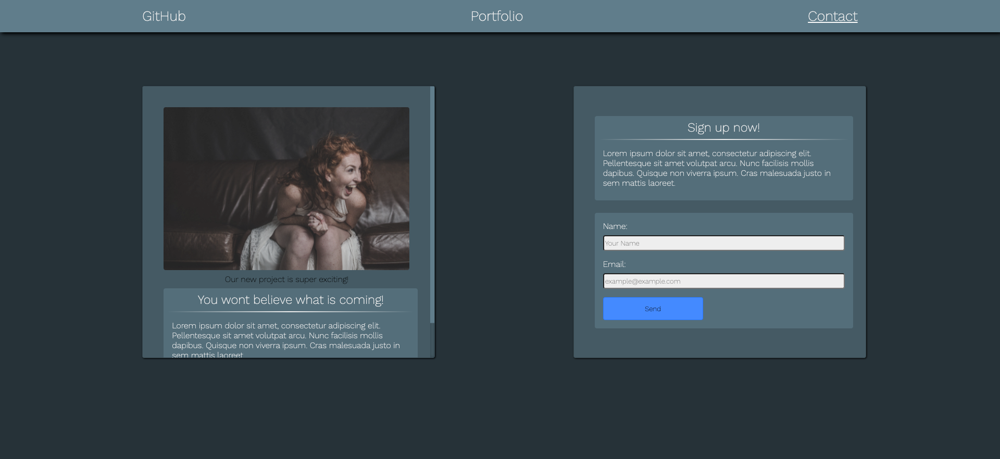
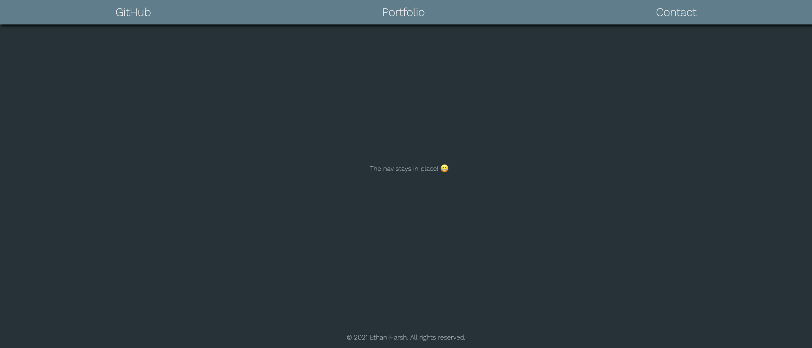

# 22-Stu_Mini-Project-OSU_Bootcamp-Unit-1
## 01-HTML-Git-CSS-Mini-Project
  

This project was created for The Ohio State University's Coding Bootcamp in 2021.

## Description
The client needed a coming soon page made for their portfolio.
The client wanted:
- A single page
- A header & footer
- An image with a caption
- A contact form
- Polished and accessible UI
## Skills Learned
- [HTML/CSS](https://www.w3.org/standards/webdesign/htmlcss)
- [Semantic HTML](https://developer.mozilla.org/en-US/docs/Learn/Accessibility/HTML)
- [Advanced CSS](https://developer.mozilla.org/en-US/docs/Learn/CSS/Building_blocks/Advanced_styling_effects)
- [HTML Forms](https://developer.mozilla.org/en-US/docs/Web/HTML/Element/form)
- [UI Basics](https://uxdesign.cc/how-to-become-a-ui-ux-designer-self-taught-8a511170fd7c)
## Resources
 - Design -> [Material.io](https://material.io/design/introduction)
 - General Reference -> [MDN](https://developer.mozilla.org/en-US/)
## Project Deployment
[GitHub Pages](https://ethanharsh.github.io/22-Stu_Mini-Project-OSU_Bootcamp-Unit-1/)
---
